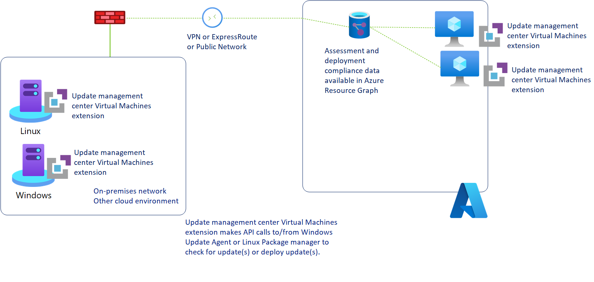
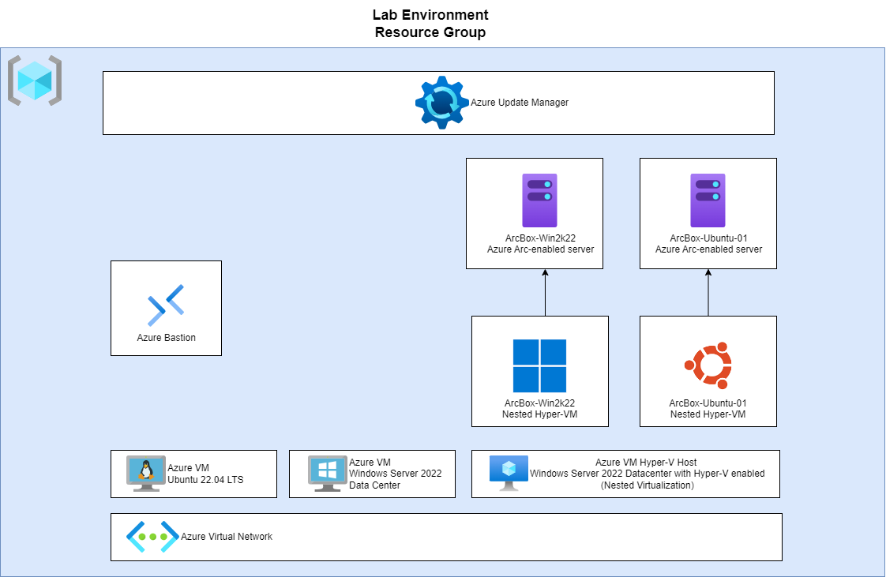

# **MicroHack Azure Update Manager**

- [**MicroHack Azure Monitor for virtual machines**](#microhack-azure-monitor-for-virtual-machines)
  - [**MicroHack introduction and context**](#microhack-introduction-and-context)
  - [**Objectives**](#objectives)
  - [**Prerequisites**](#prerequisites)
  - [**Lab environment for this MicroHack**](#lab-environment-for-this-microhack)
    - [Deployment](#deployment)
      - [ARM Deployment](#arm-deployment)
      - [Terraform Method](#terraform-method)
  - [**MicroHack Challenges**](#microhack-challenges)
  - [**Solution Guide**](#solution-guide)
  - [**Finished?**](#finished)
    - [Delete your lab](#delete-your-lab)
  - [**Contributor**](#contributor)

## **MicroHack introduction and context**

In any Infrastructure as a Service (IaaS) setup, responsibilities such as managing the operating system (OS), runtimes, middlewares, applications, and data squarely fall on the user's shoulders (refer to [this article](https://learn.microsoft.com/en-us/azure/security/fundamentals/shared-responsibility#division-of-responsibility)). A significant aspect of managing the OS includes not just configuring it, but also ensuring it's up-to-date with the latest patches to maintain a robust security posture and optimal performance. This is one of the core elements of a zero-day vulnerability and the overall security strategy.

In many cases, users might have existing on-premises solutions like System Center Configuration Manager (SCCM) to manage updates, which can be extended to the cloud. Yet, transitioning to cloud-native technologies could offer more streamlined, integrated solutions. This is where **Azure Update Manager** steps into the limelight. It's a cloud-native solution within Azure, tailored to aid in the meticulous management of updates for these more personalized, unique virtual machine instances, ensuring they remain patched and secure. With Azure Update Management, users have a dedicated tool to help manage the critical responsibility of patching, which is indispensable for maintaining a secure, stable, and compliant infrastructure in the cloud.

Utilizing **Azure Update Manager**, you can centrally orchestrate the updating of operating systems, modify update configurations, and manage the deployment of necessary updates across your Windows and Linux Virtual Machines within Azure, as well as physical or VMs hosted in on-premises environments and other cloud platforms. 

You can also use the Azure Update Manager's reporting features to quickly check the status of pending updates and manage their installation process for your machines. 

The solution has made substantial improvement in addressing the limitations encountered with the automation update management:
* The onboarding process, which used to be somewhat cumbersome, has undergone a substantial overhaul. Instead of relying on log analytics for storing patch data and state, the system now utilizes the Azure resource graph. This graph, well-known to those familiar with Azure, is a high-performance database that enables us to access and retrieve information about all our Azure resources efficiently. This transition eliminates the need for a dedicated log analytics workspace or an Azure automation account, making it an integral part of the Azure Fabric.

* Furthermore, with the migration away from Azure automation, the hybrid runbook worker is no longer in use. Instead, the system has adopted an extension-based approach. While this offers flexibility, it necessitates specific requirements for interacting with non-Azure components. For Azure VMs, adding extensions is straightforward, given their integration into the Azure resource manager. These extensions are automatically added when the system requires patching, eliminating any need for proactive setup. However, for non-Azure resources, Arc enablement is now a prerequisite. It's worth noting that Arc enabled server OS is free and provides basic inventory information, control-level fabric details, SSH access, and extension support. This requirement streamlines the management process.

* This transition brings significant benefits, especially in terms of scheduling. Users gain access to robust scheduling options, allowing them to plan activities such as post-Patch Tuesday updates with precision. 

* The system also supports the creation of diverse machine groups based on various attributes, accommodating different environments and locations. 

* Additionally, granular VM-level role-based access control (RBAC) capabilities ensure precise control over permissions.

In summary, the system's transformation enhances its functionality and ease of use. The reliance on Azure's native capabilities, such as the resource graph and Arc enablement, simplifies operations while offering a wealth of features for managing updates effectively.

The next diagram shows how the Update Manager checks for and installs updates on all Azure machines and Azure Arc-enabled servers, for both Windows and Linux.

**Azure Update Manager** is accessible in all Azure public regions where virtual machines are offered. However, for Azure Arc-enabled servers, support is currently limited to only the specified [regions](https://learn.microsoft.com/en-us/azure/update-center/support-matrix?tabs=azurearc%2Cazurevm-os#supported-regions). 

## **Objectives**

After completing this MicroHack you will:

- be able to take immediate control of your updates by manually checking, installing updates and changing settings like periodic assessment, patch orchestration options.
- be able to make sure your machines are always up-to-date with automatic update at scale.
- be able to monitor and manage your machines, schedules and track history at scale.
- [Optional]: be able to apply Extended Security Updates (ESU) for older Windows like Windows 2012 and 2012R2

## **Prerequisites**

In order to use the MicroHack time most effectively, the following tasks should be completed prior to starting the session:

- Ensure that you have an active Azure subscription. If you do not have one, you can create a free account [here](https://azure.microsoft.com/en-us/free/).

- Your account must be a member of the Azure Owner or Contributor role in the subscription.

## **Lab environment for this MicroHack**

To experiment with Azure Update Manager and learn how to use it, we will deploy two lab environments:
- the first one is a Azure native scenario consisting of  2 Azure VMs (Windows Server 2022 VM, Azure Ubuntu 22.04)
- for the second lab environment we use a modified version of the jumpstart ArcBox to deployed Azure Arc-encabled Servers. and 2 Azure Arc Enable Servers (Windows Server 2019 and  Ubuntu 20.04 LTS). 

> **Note:** This is not intend to be a microhack about Azure Arc-Enabled Servers, but only to demonstrate the Azure Update Manager capabilities for Arc-Enabled Servers. The lab environment is based on [Azure Arc Jumpstart ArcBox](https://github.com/microsoft/azure_arc/blob/arc_servers_levelup/docs/azure_jumpstart_arcbox/_index.md)

Below an architecure diagram displays the setup. Tutorials and documentation that provide step-by-step guidance on how to deploy the environment comes along.

#### Resources Deployment using Bicep

The lab environment might take up to one hour to deploy. You might want to deploy it beforehand. 

To deploy the lab environment using **Bicep**, click the link below.

- [Deploy to Azure (Bicep)](./resources/bicep/README.md)

Let's start with the challenges to master Azure Update Manager.

## **MicroHack Challenges**

- Challenge 0: **[Explore the lab environment](challenges/00_challenge.md)**
- Challenge 1: **[Assess machines for missing updates](challenges/01_challenge.md)**
- Challenge 2: **[Apply patches on your machines (scheduled and one-time updates)](challenges/02_challenge.md)**
- Challenge 3: **[Schedule patching configuration on Azure VMs for Business continuity](challenges/03_challenge.md)**
- Challenge 4: **[Monitor and manage your machines and track update history at scale](challenges/04_challenge.md)**
- Challenge 5: **[Optional: Configure Update Manager with WSUS](challenges/05_challenge.md)**

## **Solution Guide**

- Walkthrough Challenge 0: **[Install and Explore the lab environment](walkthrough/challenge-0/solution.md)**
- Walkthrough Challenge 1: **[Assess machines for missing updates](walkthrough/challenge-1/solution.md)**
- Walkthrough Challenge 2: **[Apply patches on your machines (scheduled and one-time updates)](walkthrough/challenge-2/solution.md)**
- Walkthrough Challenge 3: **[Schedule patching configuration on Azure VMs for Business continuity](walkthrough/challenge-3/solution.md)**
- WalkthroughChallenge 4: **[Monitor and manage your machines and track update history at scale](walkthrough/challenges-34/solution.md)**
- Walkthrough Challenge 5: **[Optional: Configure Update Manager with WSUS](walkthrough/challenge-5/solution.md)**

## **Finished?**

Congratulations! : You finished the MicroHack for Azure Update Manager.

We hope you've had the opportunity to experience Azure Update Manager features.

If you would like to give us feedback, please don't hesitate to open an issue in the repository or contact one of us directly.

Thank you for taking the time and see you next time!

### Delete your lab

If you have used your own subscription to provision the lab, you can delete the lab environment by simply deleting the resource group you created. If you have used the provisioned subscription, no action is required.

## **Contributors**

- [Herman Diessongo](https://www.linkedin.com/in/herman-diessongo-phd-399b5152)

