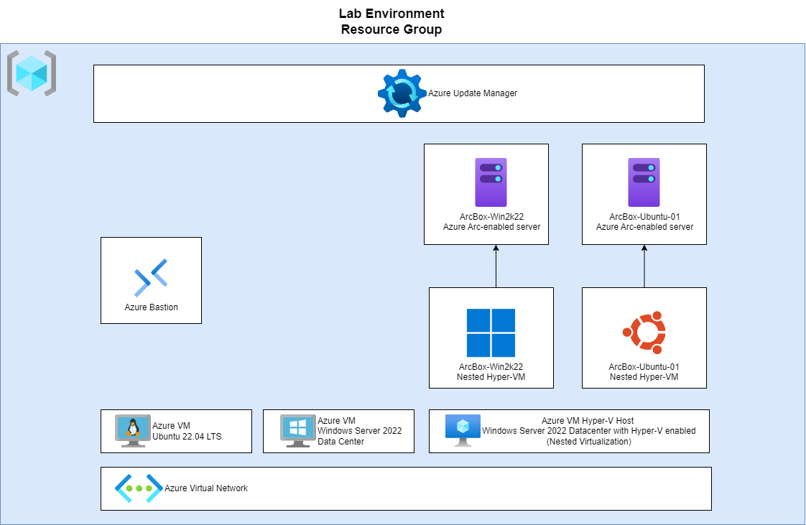

# Deploying the Lab Environment Resources

The lab environment is a modified version of the ArcBox thatis intended for users who want to experience Azure Arc-enabled servers capabilities in a sandbox environment. It has been extended with two Azure VMs for the purpose of this microhack. 



## Prerequisites

Before beginning this lab, it's crucial to understand a few important prerequisites associated with this MicroHack:

* Your own Azure subscription with Owner RBAC rights at the subscription level
  * [Azure Evaluation free account](https://azure.microsoft.com/en-us/free/search/?OCID=AIDcmmzzaokddl_SEM_0fa7acb99db91c1fb85fcfd489e5ca6e:G:s&ef_id=0fa7acb99db91c1fb85fcfd489e5ca6e:G:s&msclkid=0fa7acb99db91c1fb85fcfd489e5ca6e)
* [Azure CLI](https://learn.microsoft.com/en-us/cli/azure/install-azure-cli) (Hint: Make sure to use the lastest version). If already install use the below 
* [Azure Bicep](https://learn.microsoft.com/en-us/azure/azure-resource-manager/bicep/install)
* [Visual Studio Code](https://code.visualstudio.com/)
* [Git SCM](https://git-scm.com/download/)

## Getting Started

To get started, follow these steps:

1. Clone this repository to your local machine.
    ```shell
    git clone https://github.com/microsoft/MicroHack.git
    ```

2. Open a command prompt or terminal window and navigate to the project directory `/08_Azure_Upate_Manager/resources/bicep` of the cloned repository.
3. Login to Az CLI and select your subscription using the following commands:

    ```shell
    az login

    az account set --subscription <subscription-id>
    ```
> **Note**  
    >  ArcBox must be deployed to one of the following regions. Deploying ArcBox outside of these regions may result in unexpected results or deployment errors.
    > * East US
    > * East US 2
    > * Central US
    > * West US 2
    > * North Europe
    > * West Europe
    > * France Central
    > * UK South
    > * Australia East
    > * Japan East
    > * Korea Central
    > * Southeast Asia

4. ArcBox requires 16 DSv4-series vCPUs when deploying with default parameters such as VM series/size. Ensure you have sufficient vCPU quota available in your Azure subscription and the region where you plan to deploy ArcBox. You can use the below Az CLI command to check your vCPU utilization:

    ```shell
    az vm list-usage --location <your location> --output table
    ```

5. Register necessary Azure resource providers by running the following commands.

    ```shell
    az provider register --namespace Microsoft.HybridCompute --wait
    az provider register --namespace Microsoft.GuestConfiguration --wait
    az provider register --namespace Microsoft.AzureArcData --wait
    az provider register --namespace Microsoft.OperationsManagement --wait
    az provider register --namespace Microsoft.SecurityInsights --wait
    ```
6. Create Azure service principal (SP). To deploy ArcBox, an Azure service principal assigned with the Owner Role-based access control (RBAC) role is required. You can use Azure Cloud Shell (or other Bash shell), or PowerShell to create the service principal.

    ```shell
    subscriptionId="<Your Subscription Id>"
    servicePrincipalName="<Unique Service principal name>"

    az account set -s $subscriptionId
    az ad sp create-for-rbac -n $servicePrincipalName --role "Owner" --scopes /subscriptions/$subscriptionId
    ```

    For example:
    ```shell
    subscriptionId="f3a21b12-4f6a-4c53-9b2f-7a2b9c5a6f84"
    servicePrincipalName="SPNLabArcBox"

    az account set -s $subscriptionId
    az ad sp create-for-rbac -n $servicePrincipalName --role "Owner" --scopes /subscriptions/$subscriptionId
    ```
    Output should look similar to this:
    ```JSON
    {
        "appId": "XXXXXXXXXXXXXXXXXXXXXXXXXXXX",
        "displayName": "SPNLabArcBox",
        "password": "XXXXXXXXXXXXXXXXXXXXXXXXXXXX",
        "tenant": "XXXXXXXXXXXXXXXXXXXXXXXXXXXX"
    }
    ```


7. Bicep deployment via Azure CLI

    Make sure you  are in the `/08_Azure_Upate_Manager/resources/bicep` directory

    run
    ```shell
    az bicep upgrade
    ```

    Edit the [main.parameters.json](./main.parameters.json) template parameters file and supply some values for your environment.
    - _`spnClientId`_ - Your Azure service principal id
    - _`spnClientSecret`_ - Your Azure service principal secret
    - _`spnTenantId`_ - Your Azure tenant id
    - _`AdminUsername`_ -  VM Administrator name
    - _`AdminPassword`_ - VM Password. Password must have 3 of the following: 1 lower case character, 1 upper case character, 1 number, and 1 special character. The value must be between 12 and 123 characters long.

     

    Now you will deploy the Bicep file. Navigate to the local cloned [deployment folder](https://github.com/microsoft/azure_arc/tree/main/azure_jumpstart_arcbox/bicep) and run the below command:

    ```shell
    az group create --name "<resource-group-name>" --location "<preferred-location>"
    az deployment group create -g "<resource-group-name>" -f "main.bicep" -p "main.parameters.json"
    ```

    > **NOTE: If you see any failure in the deployment, please check the [troubleshooting guide](https://azurearcjumpstart.io/azure_jumpstart_arcbox/itpro/#basic-troubleshooting).**

    > **NOTE: The deployment takes around 20 minutes to complete.**
 

8. Connect using Azure Bastion
- Use Azure Bastion to connect to the VM.

  

  > **NOTE: When using Azure Bastion, the desktop background image is not visible. Therefore some screenshots in this guide may not exactly match your experience if you are connecting to _ArcBox-Client_ with Azure Bastion.**

    The Logon scripts

    - Once you log into the _ArcBox-Client_ VM, multiple automated scripts will open and start running. These scripts usually take 10-20 minutes to finish, and once completed, the script windows will close automatically. At this point, the deployment is complete.

    

    - Deployment is complete! Let's begin exploring the features of Azure Arc-enabled servers with the Level-up modules.

    

    


